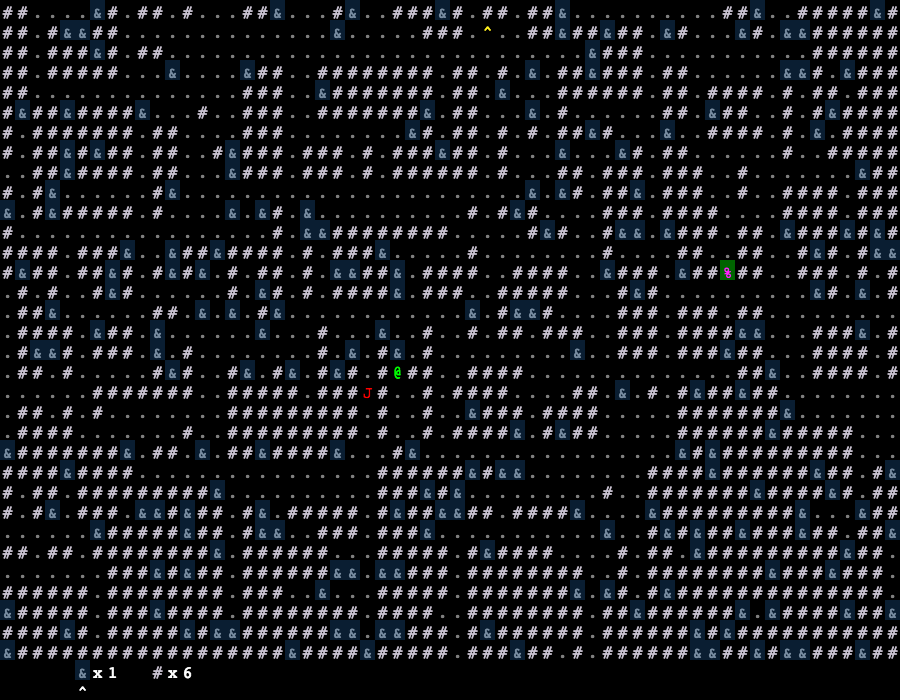

# A rougelike game written in Webassembly and Rust

Blocks:
* `#`, `&` - Walls
* `.` - Ground
* `^` - Random teleporter
* `%` - Regenerate level
* `@` - You
* `J` - Enemy

Controls:

* [arrow]: Move in that direction
* Shift+[arrow]: Run in that direction
* M + [arrow]: Mine the block in that direction
* P + [arrow]: Place block in that direction
* +/-: Change inventory item
* R: Regenerate level